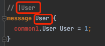
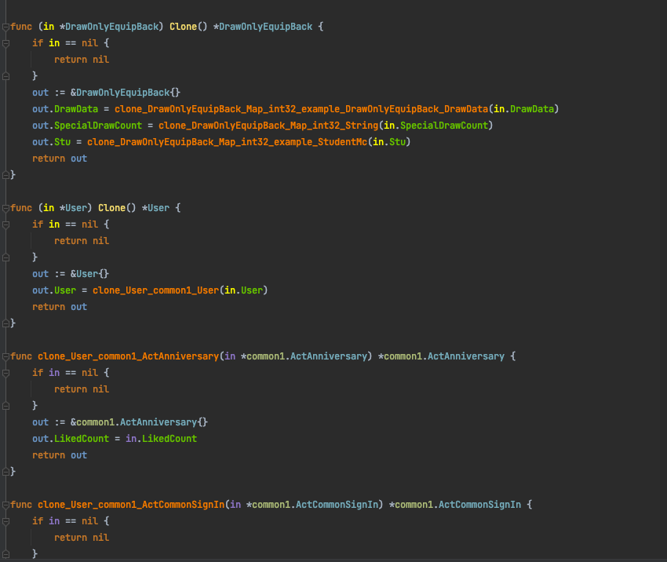

# protoc-gen-go-clone
``proto代码克隆工具,可以将proto2和proto3代码克隆生成go代码``

## 安装工具
``require go version 1.17``

``go install github.com/junaozun/protoc-gen-go-clone/cmd/protoc-gen-clone``
 
## 使用方法
``先将想要克隆的message对象加上克隆的规则：|messageName,如下：``


````
protoc -I=$(API_PATH) --proto_path=$(ROOT)/protos --proto_path=$(ROOT)/protos/out --proto_path==$(ROOT)/protos/in --proto_path=$(MODEL_PATH) --clone_out=plugins=clone,paths=source_relative:$(API_PATH) xxx.proto

其余写法与protoc-gen-go一致,只需要更换--clone_out=plugins=clone就能生成克隆代码
`````
## 生成结果


``使用时只需要调用该对象的Clone方法``
